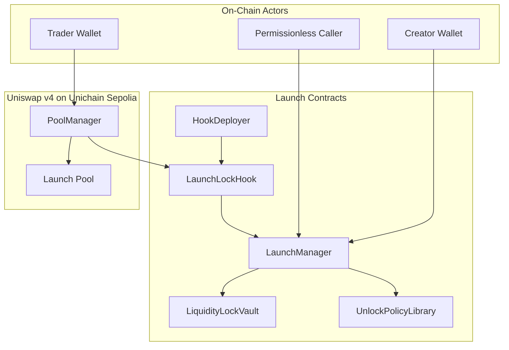
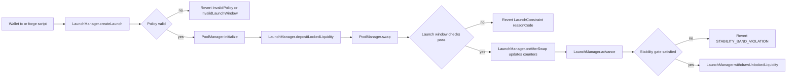
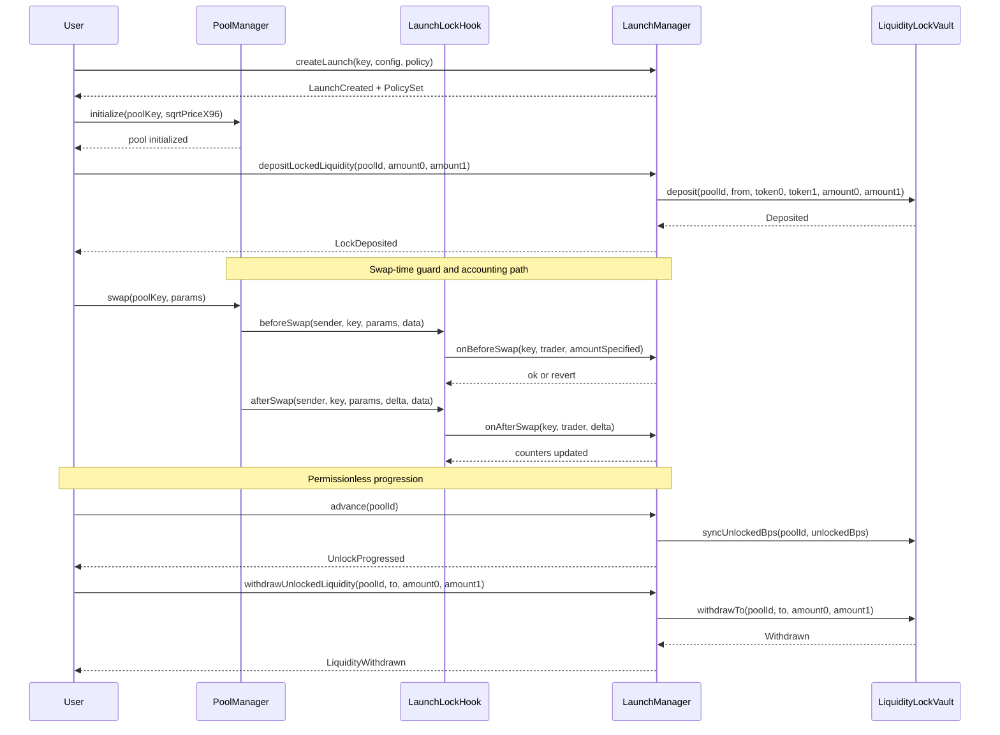

# Liquidity Locking & Token Launch Hook
**Built on Uniswap v4 · Deployed on Unichain Sepolia**
_Targeting: Uniswap Foundation Prize · Unichain Prize_

> Deterministic launch protection for Uniswap v4 pools: lock liquidity at launch, enforce swap-time guards, and unlock only when on-chain time/volume/stability conditions are satisfied.

[](https://github.com/josh-hooah/liquidity-locking-and-token-launch-hook/actions/workflows/test.yml)
[](#test-coverage)
[](https://github.com/ethereum/solidity/releases/tag/v0.8.26)
[](https://docs.uniswap.org/contracts/v4/overview)
[](https://sepolia.uniscan.xyz)

## The Problem
Launch pools fail when early liquidity is exposed before price discovery stabilizes and when unlocks are discretionary or off-chain.

| Layer | Failure Mode |
|---|---|
| Swap Entry | Oversized first-window buys consume depth and spike price. |
| Market Access | Address-level bot rotation bypasses weak launch constraints. |
| Liquidity Custody | Liquidity can be withdrawn before deterministic milestones. |
| Unlock Logic | Time/volume gates are often off-chain or operator-driven. |
| Governance | Emergency controls can be misused without clear bounds. |

These failures turn early launches into adverse-selection environments where late participants absorb slippage and inventory risk.

## The Solution
The system enforces launch policy at swap time and keeps unlock custody separate from hook execution.

1. `LaunchManager.createLaunch()` stores immutable launch scope and validated policy arrays.
2. `LaunchLockHook.beforeSwap()` delegates guard checks to `LaunchManager.onBeforeSwap()`.
3. `LaunchLockHook.afterSwap()` delegates deterministic accounting to `LaunchManager.onAfterSwap()`.
4. `LaunchManager.advance()` computes candidate unlock from time/volume/stability rules.
5. `LiquidityLockVault.syncUnlockedBps()` records monotonic unlock state.
6. `LiquidityLockVault.withdrawTo()` allows withdrawal only within unlocked bounds.

Core insight: if swap-time guards and unlock accounting share one deterministic on-chain state model, launch protection does not need keepers.

## Architecture

### Component Overview
```text
LaunchProtectionSystem
├─ LaunchLockHook
│  └─ Minimal Uniswap v4 hook; forwards swap callbacks to manager.
├─ LaunchManager
│  └─ Policy engine; launch registry; unlock progression state machine.
├─ LiquidityLockVault
│  └─ Asset custody; enforces unlocked-withdrawal bounds.
├─ UnlockPolicyLibrary
│  └─ Policy validation and TIME/VOLUME/HYBRID unlock math.
└─ HookDeployer
   └─ CREATE2 deploy helper for permission-bit-compliant hook addresses.
```

### Architecture Flow (Subgraphs)


### User Perspective Flow


### Interaction Sequence


## Launch Policy Engine
| Mode / State | Trigger | Deterministic Rule | Effect |
|---|---|---|---|
| `TIME` | `advance()` | Epoch progression after cliff | Unlock by `timeUnlockBpsPerEpoch` |
| `VOLUME` | `afterSwap` + `advance()` | Cumulative `BalanceDelta` vs milestones | Unlock at milestone BPS |
| `HYBRID` | `advance()` | `min(timeBps, volumeBps)` | Conservative unlock path |
| `ACTIVE` | Launch created or unpaused | Normal guards and progression | Swaps and unlock logic enabled |
| `PAUSED` | `setEmergencyPause(true)` or policy pause | `advance()` and guarded swaps revert | Freeze progression |
| `FINALIZED` | `unlockedBps == 10000` | Terminal unlock state | Full vault withdrawal allowed |

Non-obvious behavior: HYBRID mode uses the lower of time and volume unlock candidates, so volume spikes cannot bypass time cliffs.

## Deployed Contracts

### Unichain Sepolia (chainId 1301)
| Contract | Address |
|---|---|
| PoolManager | [0x00b036b58a818b1bc34d502d3fe730db729e62ac](https://sepolia.uniscan.xyz/address/0x00b036b58a818b1bc34d502d3fe730db729e62ac) |
| PositionManager | [0xf969aee60879c54baaed9f3ed26147db216fd664](https://sepolia.uniscan.xyz/address/0xf969aee60879c54baaed9f3ed26147db216fd664) |
| Quoter | [0x56dcd40a3f2d466f48e7f48bdbe5cc9b92ae4472](https://sepolia.uniscan.xyz/address/0x56dcd40a3f2d466f48e7f48bdbe5cc9b92ae4472) |
| StateView | [0xc199f1072a74d4e905aba1a84d9a45e2546b6222](https://sepolia.uniscan.xyz/address/0xc199f1072a74d4e905aba1a84d9a45e2546b6222) |
| UniversalRouter | [0xf70536b3bcc1bd1a972dc186a2cf84cc6da6be5d](https://sepolia.uniscan.xyz/address/0xf70536b3bcc1bd1a972dc186a2cf84cc6da6be5d) |
| LiquidityLockVault | [0xb664e46c230951da4389e195188aa4203fa76af0](https://sepolia.uniscan.xyz/address/0xb664e46c230951da4389e195188aa4203fa76af0) |
| LaunchManager | [0x53edcb5facceede8a1eac2237daebf7fc983a574](https://sepolia.uniscan.xyz/address/0x53edcb5facceede8a1eac2237daebf7fc983a574) |
| HookDeployer | [0x3726b4eaf838fcff2096461a920fa277af313317](https://sepolia.uniscan.xyz/address/0x3726b4eaf838fcff2096461a920fa277af313317) |
| LaunchLockHook | [0x8165120e7c04bd5f52df16d90365f87c1dfe80c0](https://sepolia.uniscan.xyz/address/0x8165120e7c04bd5f52df16d90365f87c1dfe80c0) |

## Live Demo Evidence
Demo run date: **2026-03-12 (UTC)**.

### Phase 1 — Launch Configuration (Unichain Sepolia, chainId 1301)
| Action | Transaction |
|---|---|
| Create launch with VOLUME policy | [0x4a3a2ec5…](https://sepolia.uniscan.xyz/tx/0x4a3a2ec5b8b6729513fda5ce28ca6e9df1b8c1e9a8ecb8025ed7bb8c1b6e57d8) |

### Phase 2 — Pool Bootstrap and Liquidity Lock (Unichain Sepolia, chainId 1301)
| Action | Transaction |
|---|---|
| Initialize pool | [0x38a56020…](https://sepolia.uniscan.xyz/tx/0x38a56020e31f131d03c8bb86773089903b3e50e23ab88e94a2cb4a89eec60618) |
| Seed position liquidity | [0x2b1d7a30…](https://sepolia.uniscan.xyz/tx/0x2b1d7a3071dbf20ad1695f8cf1ff51190c9c5c1745b23264610011d3d75a0ed8) |
| Deposit locked liquidity to vault | [0xb0f3f464…](https://sepolia.uniscan.xyz/tx/0xb0f3f46419f4792799b77d41580b6fac2fa336ec4c9e6d71c8c3d1bcae47765c) |

### Phase 3 — Swap Guard and Accounting Path (Unichain Sepolia, chainId 1301)
| Action | Transaction |
|---|---|
| Execute compliant swap | [0x1acf2b29…](https://sepolia.uniscan.xyz/tx/0x1acf2b294684837a8c88b23f4960992659f5cbe088783af5731631fa672bff30) |

### Phase 4 — Permissionless Progression and Bounded Withdrawal (Unichain Sepolia, chainId 1301)
| Action | Transaction |
|---|---|
| Progress unlock with `advance()` | [0xd191348d…](https://sepolia.uniscan.xyz/tx/0xd191348d8b76bc7a28c971c5a98e86760bf09d5954795c0d4bd109cab8915d3d) |
| Withdraw unlocked tranche | [0x37bfe50c…](https://sepolia.uniscan.xyz/tx/0x37bfe50cf02862eafe44716f778ab8c338a6b81a28fcb8b516b8f60dac2744d8) |

> Note: blocked oversized/cooldown swaps are intentionally executed as reverting calls in-script (not broadcast), while unlock state (`DEMO_UNLOCKED_BPS`) and remaining withdrawable amounts are read on-chain and printed off-chain in Foundry logs.

## Running the Demo
```bash
# Full testnet lifecycle demo with tx + explorer output
make demo-testnet
```

```bash
# Launch-window guard focused phase
make demo-launch-window
# Unlock progression focused phase
make demo-unlock
```

```bash
# Local lifecycle demo against Anvil
make demo-local
# Full local scripted lifecycle suite
make demo-all
```

## Test Coverage
```text
Lines:       100.00% (299/299)
Statements:   97.16% (342/352)
Branches:     84.85% (56/66)
Functions:   100.00% (45/45)
```

```bash
# Reproduce coverage report
make coverage
```

- `unit`: launch policy bounds, access control, pause, max-tx, cooldown, vault accounting.
- `fuzz`: monotonic unlock bounds, monotonic volume counters, withdrawal never exceeds unlocked.
- `integration`: full launch lifecycle with real v4 PoolManager callbacks and routers.

## Repository Structure
```text
.
├── src/
├── scripts/
├── test/
└── docs/
```

## Documentation Index
| Doc | Description |
|---|---|
| `docs/overview.md` | System scope and launch-protection goals. |
| `docs/architecture.md` | Contract-level call flow and boundaries. |
| `docs/launch-model.md` | TIME/VOLUME/HYBRID policy semantics. |
| `docs/liquidity-lock.md` | Vault custody model and withdrawal math. |
| `docs/anti-sniping.md` | Max-tx and cooldown behavior/tradeoffs. |
| `docs/security.md` | Threat model, mitigations, residual risks. |
| `docs/deployment.md` | Deployment flow and persisted addresses. |
| `docs/demo.md` | Demo phases and expected observable outputs. |
| `docs/api.md` | Public interfaces and major function surfaces. |
| `docs/testing.md` | Test taxonomy and coverage reproduction. |

## Key Design Decisions
**Why keep the hook minimal and delegate logic to `LaunchManager`?**  
Hook execution is in the swap hot path, so it should do bounded work and avoid heavy state branching. Delegation keeps callback code small and makes policy upgrades auditable without changing callback semantics.

**Why store locked assets in `LiquidityLockVault` instead of embedding custody in the hook?**  
Custody and swap interception have different threat surfaces. A dedicated vault isolates token accounting, uses `ReentrancyGuard`, and enforces monotonic unlock constraints independently of hook execution.

**Why make `advance()` permissionless?**  
Correctness should not depend on an operator or keeper schedule. Any actor can trigger progression, while idempotency and monotonic state checks prevent double-counting unlocks.

**Why use `BalanceDelta`-derived cumulative volume with a minimum trade filter?**  
Volume accounting is deterministic and entirely on-chain from swap deltas. The minimum trade threshold reduces trivial dust self-trades while keeping the model simple and auditable.

## Roadmap
- [ ] Add explicit allowlist module with bounded state lifetime for launch windows.
- [ ] Add dedicated malicious-token reentrancy harness tests for vault paths.
- [ ] Add optional protocol fee switch with immutable fee caps.
- [ ] Add on-chain config template registry for standard launch presets.
- [ ] Complete third-party audit and publish remediation report.

## License
MIT
