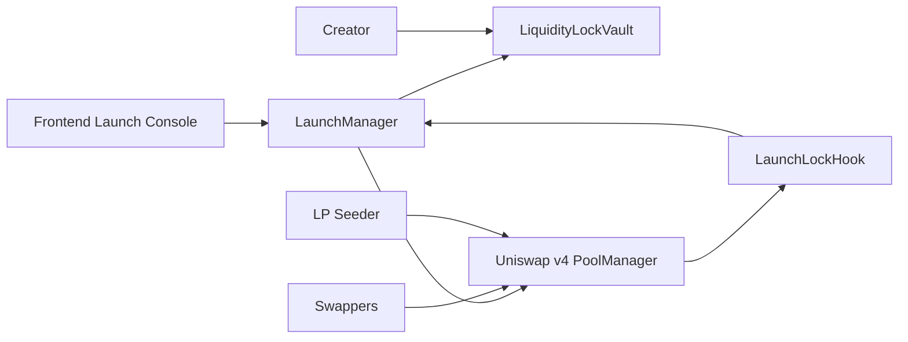
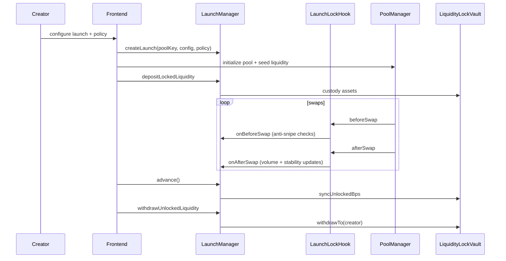
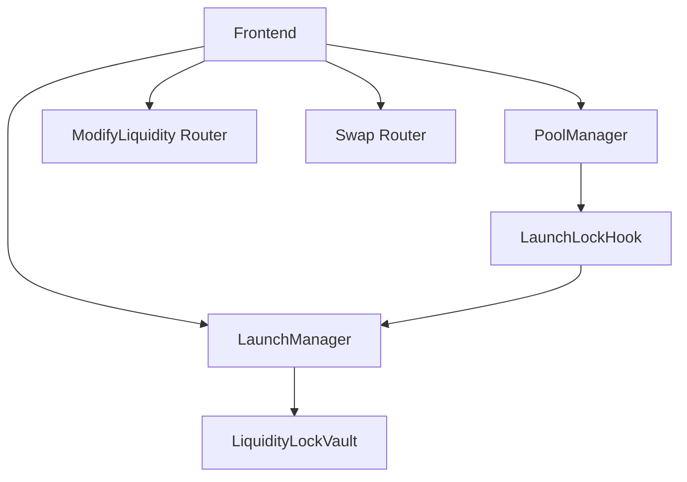

# Liquidity Locking & Token Launch Hook


Deterministic launch protection primitive for Uniswap v4 pools.

This monorepo implements a launch manager + v4 hook architecture that:

- locks launch liquidity at bootstrap
- blocks toxic launch-window swaps (max tx and cooldown)
- unlocks liquidity progressively from deterministic on-chain criteria
- allows permissionless unlock progression via `advance()`
- avoids offchain keepers/bots for correctness
- does not integrate Reactive network components

## Problem
Token launches are highly fragile in the first minutes/hours:

- snipers can consume early liquidity with oversized trades
- creators can mismanage unlock schedules
- unlock logic is often offchain or discretionary

## Solution
A minimal v4 swap hook (`LaunchLockHook`) delegates policy enforcement and accounting to `LaunchManager`, while `LiquidityLockVault` enforces unlocked-withdrawal bounds over custody assets.

Unlock modes:

- Time-Based Unlock (TBU)
- Volume-Based Unlock (VBU)
- Hybrid mode (`min(timeBps, volumeBps)`)

Market behavior gating:

- deterministic stability band gate before unlock progression
- anti-snipe launch-window max tx + cooldown

## Architecture






## Repository Layout

- `src/` core contracts
- `test/` unit, fuzz, and integration tests
- `script/` Foundry deployment/demo scripts
- `scripts/` bash automation (bootstrap, deploy, demos)
- `frontend/` static launch console
- `shared/` ABI + shared type artifacts
- `docs/` detailed docs set
- `assets/` integration SVG marks

## Quickstart
```bash
make bootstrap
make build
make test
```

## Demo Flow
Local demo:

```bash
make demo-local
make demo-launch-window
make demo-unlock
make demo-all
```

Unichain Sepolia demo (reuses deployed system from `.env`):

```bash
cp .env.example .env
# fill signer + rpc values
make deploy-testnet
make demo-testnet
```

Demo output includes:

- deployed contract addresses
- blocked vs allowed swaps
- unlock bps progression
- withdrawn vs remaining unlockable liquidity
- tx hashes and explorer URLs (or `TBD <hash>` when base URL is not configured)

## Deployment
Local:

```bash
make deploy-local
```

Unichain Sepolia:

```bash
make deploy-testnet
```

Current address table:

- Local Anvil (`31337`): generated per run, printed by scripts
- Unichain Sepolia (`1301`): deployment script writes these into `.env`
  - `POOL_MANAGER_ADDRESS=0x00b036b58a818b1bc34d502d3fe730db729e62ac`
  - `LIQUIDITY_LOCK_VAULT_ADDRESS=0xb664e46c230951da4389e195188aa4203fa76af0`
  - `LAUNCH_MANAGER_ADDRESS=0x53edcb5facceede8a1eac2237daebf7fc983a574`
  - `HOOK_DEPLOYER_ADDRESS=0x3726b4eaf838fcff2096461a920fa277af313317`
  - `LAUNCH_LOCK_HOOK_ADDRESS=0x8165120E7C04bD5F52dF16d90365f87C1DFe80c0`

## End-to-End Workflow
System demo phases now logged directly by `script/DemoLaunchLifecycle.s.sol`:

1. `PHASE_1_SETUP_COMPLETE`
   - creator perspective: launch console can begin setup
   - infrastructure attached (`USE_DEPLOYED_SYSTEM`) or freshly deployed (`DEPLOY_FRESH_SYSTEM`)
2. `PHASE_2_LAUNCH_CREATED`
   - creator perspective: launch config + policy are committed on-chain
   - policy logs include anti-snipe max-tx, cooldown, and volume milestones
3. `PHASE_3_POOL_INITIALIZED_AND_LIQUIDITY_LOCKED`
   - creator perspective: pool initialized and seed liquidity moved into vault custody
4. `PHASE_4_ALLOWED_SWAP_EXECUTED` + blocked checks
   - trader perspective: compliant swap succeeds
   - oversized/cooldown-violating attempts are shown as blocked in demo logs
5. `PHASE_5_PERMISSIONLESS_ADVANCE_EXECUTED`
   - anyone can call `advance()` to progress deterministic unlock state
6. `PHASE_6_CREATOR_WITHDREW_UNLOCKED_PORTION`
   - creator perspective: only unlocked liquidity can be withdrawn
   - remainder remains locked and protected

Every broadcast transaction is printed with:
- status
- tx hash
- contract/function
- gas used
- explorer URL

## Dependency Pinning
Pinned refs:

- `v4-periphery`: `3779387e5d296f39df543d23524b050f89a62917`
- `v4-core`: `59d3ecf53afa9264a16bba0e38f4c5d2231f80bc`

Validate pins:

```bash
make deps-check
```

## Security and Trust Model
- Admin/creator can pause launches and update policy.
- Users should verify policy parameters pre-launch.
- Volume unlock is mitigated with minimum trade-size filters but not wash-trade-proof.
- Multi-address sniping remains a residual risk under any per-address cooldown model.

See:

- [security.md](docs/security.md)
- [SECURITY.md](SECURITY.md)

## Documentation Index
- [overview](docs/overview.md)
- [architecture](docs/architecture.md)
- [launch model](docs/launch-model.md)
- [liquidity lock](docs/liquidity-lock.md)
- [anti-sniping](docs/anti-sniping.md)
- [security](docs/security.md)
- [deployment](docs/deployment.md)
- [demo](docs/demo.md)
- [api](docs/api.md)
- [testing](docs/testing.md)
- [frontend](docs/frontend.md)
- [spec](spec.md)

## Assumptions
`/context/uniswap`, `/context/atrium`, and `/context/launch` were not populated with detailed source documents in this workspace. Implementation reconciles requirements against pinned Uniswap v4 core/periphery sources in `lib/`.
